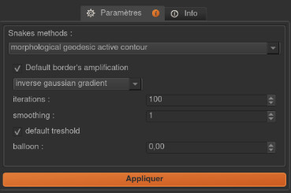

Interactive plugin
==================

In this tutorial, we will see how to implement a plugin managing user interaction through graphics objects input. 
We will illustrate this through the implementation of active contour algorithms from scikit-image library :

- `morphological_geodesic_active_contour <https://scikit-image.org/docs/stable/api/skimage.segmentation.html#morphological-geodesic-active-contour>`_
- `morphological_chan_vese <https://scikit-image.org/docs/stable/api/skimage.segmentation.html#morphological-chan-vese>`_

Active contour algorithms, also called «snakes», are segmentation methods matching a deformable model to an image region by means
of energy minimization. They require initial regions or seeds in the form of a binary mask from which an iterative update strategy 
will be applied (growth or shrinkage). Initial binary mask can be either the result of a previous task in workflow or manual 
shapes drawn by users (Ikomia graphics objects).

Here are the steps we will follow:

- Define required inputs and outputs
- Get initial contour from user graphics input or binary mask directly
- Call active contour method
- Generate results

We skip here all steps to create a new empty plugin. 
Please refer to :doc:`Hello World tutorial <hello_world_plugin>` if you are not familiar with it.

**Table of contents**

| :ref:`files_structure`
| :ref:`dependencies`
| :ref:`interface_implementation`
| :ref:`process_implementation`
|   :ref:`inputs`
|   :ref:`Outputs`
|   :ref:`active_contour_methods`
|   :ref:`results`
|   :ref:`progress_bar`
| :ref:`process_parameters`
| :ref:`process_widget`
| :ref:`process_metadata`
| :ref:`source_code`

.. _files_structure:

Plugin files structure
----------------------

- scikit_MorphoSnakes

    - __init__.py
    - requirements.txt
    - scikit_MorphoSnakes.py
    - scikit_MorphoSnakes_process.py
    - scikit_MorphoSnakes_widget.py

.. _dependencies:

Dependencies
------------

- OpenCV: basic image operations (built-in in Ikomia software)
- scikit-image: active contour algorithms

Plugin dependencies are listed in *requirements.txt* so that they will be automatically installed by Ikomia software
during plugin installation. More information about dependency management :doc:`here <dependencies>`.

.. _interface_implementation:

Interface implementation
------------------------

No features added from the default implementation.
See `scikit_MorphoSnakes.py <https://github.com/Ikomia-dev/IkomiaPluginsPython/blob/master/scikit_MorphoSnakes/scikit_MorphoSnakes.py>`_.

.. _process_implementation:

Process implementation
----------------------

Import statements in *scikit_MorphoSnakes_process.py*:

.. code-block:: python

    from ikomia import core, dataprocess
    import copy
    # your imports below
    from skimage.segmentation import (morphological_geodesic_active_contour, inverse_gaussian_gradient, morphological_chan_vese)
    from skimage import img_as_float
    import numpy as np
    import cv2

.. _inputs:

Inputs
^^^^^^

Our active contour methods are designed to process 2D images, the corresponding base class from which our 
scikit_MorphoSnakesProcess class inherits is :py:class:`~ikomia.dataprocess.pydataprocess.CImageProcess2d`. It comes with built-in inputs :

- Source image (:py:class:`~ikomia.dataprocess.pydataprocess.CImageProcessIO`)
- Graphics (:py:class:`~ikomia.dataprocess.pydataprocess.CGraphicsInput`)

As we discuss earlier, seeds for active contour methods can be set from graphics (user input) or binary mask directly. 
So we need to add a new image-based input of type :py:class:`~ikomia.dataprocess.pydataprocess.CImageProcessIO` to handle binary mask initialization.

.. code-block:: python

    class scikit_MorphoSnakesProcess(dataprocess.CImageProcess2d):

        def __init__(self, name, param):
            dataprocess.CImageProcess2d.__init__(self, name)
            ...
            # add input -> initial level set
            self.addInput(dataprocess.CImageProcessIO())
            ...

.. _outputs:

Outputs
^^^^^^^
Here are outputs that our plugin should returned:

- Final level set as binary mask representing segmented objects (:py:class:`~ikomia.dataprocess.pydataprocess.CImageProcess2d`): directly consummable by connected tasks in workflow.
- Image with overlay containing segmented objects displayed on top of the original image (:py:class:`~ikomia.dataprocess.pydataprocess.CImageProcess2d`): for visualization purpose.

:py:class:`~ikomia.dataprocess.pydataprocess.CImageProcess2d`-based class comes also with built-in output:

- Image (:py:class:`~ikomia.dataprocess.pydataprocess.CImageProcessIO`)

So we need to add a new image-based output of type :py:class:`~ikomia.dataprocess.pydataprocess.CImageProcessIO`.

.. code-block:: python

    class scikit_MorphoSnakesProcess(dataprocess.CImageProcess2d):

        def __init__(self, name, param):
            dataprocess.CImageProcess2d.__init__(self, name)
            ...
            # add output -> results image
            self.addOutput(dataprocess.CImageProcessIO())
            ...

.. _active_contour_methods:

Active contour methods
^^^^^^^^^^^^^^^^^^^^^^

First, we should check the input type the user gives us for the initial level set.
User can give us 2 types of input to define initial contour:

- Binary mask
- Graphics objects

If both of them are given, we have to make an arbitrary choice, so we will process the binary image first. 
Otherwise we will process graphics input. Let’s implement that in the *run()* function:

.. code-block:: python

    def run(self):
        ...
        # initial level set
        initlevelSetInput = self.getInput(2)
        if initlevelSetInput.isDataAvailable():
            # input set by previous operation in worflow  
            ...
        else :
            # input set by user
            graphInput = self.getInput(1)
            if graphInput.isDataAvailable():
                ...
            else:
                raise Exception("No initial level-set given: it must be graphics input or binary image.")
    ...

In the case of binary mask input, no extra code is needed and we just have to pass the input content to 
the scikit-image functions as both structures are numpy arrays.

.. code-block:: python

    def run(self):
        ...
        if initlevelSetInput.isDataAvailable():
            initlevelSetBinary = initlevelSetInput.getImage()
            if param.method == "mgac":
                proc_img = morphological_geodesic_active_contour(gimage, 100, init_level_set=initlevelSetBinary)
            else:
                proc_img = morphological_chan_vese(gimage, 100, init_level_set=initlevelSetBinary)
        ...

For graphics input, we need to generate a binary mask representing active contour seeds from graphics drawn by users. 
We will use 2 methods of :py:class:`~ikomia.dataprocess.pydataprocess.CImageProcess2d` to achieve that:

- :py:meth:`~ikomia.dataprocess.pydataprocess.CImageProcess2d.createGraphicsMask`: create a binary mask from :py:class:`~ikomia.dataprocess.pydataprocess.CGraphicsInput` and append it to the internal mask list.
- :py:meth:`~ikomia.dataprocess.pydataprocess.CImageProcess2d.getGraphicsMask`: get a mask from the internal mask list as numpy array.

.. code-block:: python

    def run(self):
        ...
        if graphInput.isDataAvailable():
            self.createGraphicsMask(imagef.shape[1], imagef.shape[0], graphInput)
            binImg = self.getGraphicsMask(0)
            ...
            proc_img = morphological_geodesic_active_contour(gimage, 100, init_level_set=binImg, ...)
            ...
            proc_img = morphological_chan_vese(gimage, 100,  init_level_set=binImg, ...)
        ...

The following example illustrates the use of user graphics input to define initial level set:

.. _results:

Results
^^^^^^^

The first result is the binary mask representing the final level set of the active contour method. 
We simply have to set the content of the corresponding output with the numpy array returned
by the scikit-image functions.

.. code-block:: python

    # Get output
    output = self.getOutput(0)
    # set output mask binary image
    output.setImage(proc_img)

The second result is the visualization of the segmented objects on top of the original image. 
We will use the color mask visualization offered by Ikomia software. This feature enables to
take an output mask (binary or grayscale image) and use it as color mask for another image output.
Ikomia software will then display the mask in a transparent overlay on top of this image.
Colors are fully customizable, you can set a single color for binary mask or a complete colormap for grayscale mask.

In our example, we want to display the final level set on top of the original image, so we need 
to forward the original input to a given output (see :py:meth:`~ikomia.dataprocess.pydataprocess.CImageProcess2d.forwardInputImage`):

.. code-block:: python

    self.forwardInputImage(0, 1) 

And we apply the color mask vizualisation in red (see :py:meth:`~ikomia.dataprocess.pydataprocess.CImageProcess2d.setOutputColorMap`):

.. code-block:: python

    self.setOutputColorMap(1, 0, [[255,0,0]])

.. _progress_bar:

Progress bar
^^^^^^^^^^^^

Note that functions *morphological_geodesic_active_contour()* and *morphological_chan_vese()* from scikit-image 
have one specificity that can be usefull for us. They have an *iter_callback* parameter called once per iteration
we can use to refresh the progress bar of Ikomia software. We call :py:meth:`~ikomia.core.pycore.CProtocolTask.emitStepProgress` 
in a lambda function given *to iter_callback* parameter:

.. code-block:: python

    proc_img = morphological_geodesic_active_contour(..., iter_callback=(lambda callback: self.emitStepProgress())

We also need to specify the number of iterations (steps) to our progress bar by overriding 
:py:meth:`~ikomia.core.pycore.CProtocolTask.getProgressSteps`:

.. code-block:: python

    class scikit_MorphoSnakesProcess(dataprocess.CImageProcess2d):

        def getProgressSteps(self, eltCount=1):
            param = self.getParam()
            if param.method == "mgac":
                nb_iter = param.mgac_iterations
            else :
                nb_iter = param.mcv_iterations
            
            return nb_iter

.. _process_parameters:

Process parameters
------------------

We will now focus on adding some parameters to our process. We want to control available parameters from scikit-image methods. 

Morphological active contour:

- gImage : (M, N) or (L, M, N) array, preprocessed image or volume to be segmented.
- iterations : uint, number of iterations to run.
- init_level_set : (M, N) array, or (L, M, N) array
- smoothing : uint, optional, number of time the smoothing operator is applied per iteration.
- threshold :  float, optional, areas of the image with a value smaller than this threshold will be considered borders.
- balloon :  float, optional, force to guide the contour, positive value → expand the contour / negative value → shrink the contour.
- iter_callback : function called once per iteration, optional
      
Morphological Chan Vese:

- gImage : (M, N) or (L, M, N) array, preprocessed image or volume to be segmented.
- iterations : uint, number of iterations to run.
- init_level_set : (M, N) array, or (L, M, N) array
- smoothing : uint, optional, number of time the smoothing operator is applied per iteration.
- lamnda1 : float, optional, weight parameter for the outer region.
- lamnda2 : float, optional,weight parameter for the inner region.
- iter_callback : function called once per iteration, optional

First, we add member variables in the parameters class, they will be accessible from the process.
Note the presence of functions :py:meth:`~ikomia.core.pycore.CProtocolTaskParam.setParamMap` and 
:py:meth:`~ikomia.core.pycore.CProtocolTaskParam.getParamMap()` which are required to save/load values when user wants to save his workflow.

.. code-block:: python

    class scikit_MorphoSnakesParam(core.CProtocolTaskParam):

        def __init__(self):
            core.CProtocolTaskParam.__init__(self)
            # parameters
            self.method = "mgac"
            self.mgac_amplification_contour = "Inverse gaussian gradient"
            self.mgac_iterations = 100
            self.mgac_smoothing = 1
            self.mgac_threshold = 'auto'
            self.mgac_balloon = 0
            self.mcv_iterations = 100
            self.mcv_smoothing = 1
            self.mcv_lambda1 = 1
            self.mcv_lambda2 = 1

        def setParamMap(self, paramMap):
            # Set parameters values from Ikomia application
            self.method = int(paramMap["method"])
            self.mgac_amplification_contour = int(paramMap["mgac_amplification_contour"])
            self.mgac_iterations = int(paramMap["mgac_iterations"])
            self.mgac_smoothing = int(paramMap["mgac_smoothing"])
            self.mgac_threshold = int(paramMap["mgac_threshold"])
            self.mgac_balloon = int(paramMap["mgac_balloon"])
            self.mcv_iterations = int(paramMap["mcv_iterations"])
            self.mcv_smoothing = int(paramMap["mcv_smoothing"])
            self.mcv_lambda1 = int(paramMap["mcv_lambda1"])
            self.mcv_lambda2 = int(paramMap["mcv_lambda2"])

        def getParamMap(self):
            # Send parameters values to Ikomia application
            # Create the specific dict structure (string container)
            paramMap = core.ParamMap()
            paramMap["method"] = str(self.method)
            paramMap["mgac_amplification_contour"] = str(self.mgac_amplification_contour)
            paramMap["mgac_iterations"] = str(self.mgac_iterations)
            paramMap["mgac_smoothing"] = str(self.mgac_smoothing)
            paramMap["mgac_threshold"] = str(self.mgac_threshold)
            paramMap["mgac_balloon"] = str(self.mgac_balloon)
            paramMap["mcv_iterations"] = str(self.mcv_iterations)
            paramMap["mcv_smoothing"] = str(self.mcv_smoothing)
            paramMap["mcv_lambda1"] = str(self.mcv_lambda1)
            paramMap["mcv_lambda2"] = str(self.mcv_lambda2)
            return paramMap

We now modify the *run()* method to give parameters to our function:

.. code-block:: python

    class scikit_MorphoSnakesProcess(dataprocess.CImageProcess2d):

        def run(self):
            ...
            # Get parameters
            param = self.getParam()
            ...

            proc_img = morphological_geodesic_active_contour(
                gimage, 
                param.mgac_iterations, 
                init_level_set=initlevelSetBinary, 
                smoothing=param.mgac_smoothing, 
                threshold=param.mgac_threshold,
                balloon=param.mgac_balloon, 
                iter_callback=(lambda callback: self.emitStepProgress())).astype(np.uint8) * 255

.. _process_widget:

Process widget
--------------

At this point, parameters are only available from source code. The role of the plugin widget is to open parameters 
configuration to the user. We will use PyQt framework for this example. We implement the widget part in the file 
*scikit_MorphoSnakes_widget.py*. The widget layout is created in the constructor. Like the process class, 
the constructor receives an instance of the parameters structure to initialize the widget components.

We let the user choose the active contour method, so we need him to select the method in order to display 
the appropriate parameters. We will use the **QStackedWidget** component.

Global widget initialization

.. code-block:: python

    class scikit_MorphoSnakesWidget(core.CProtocolTaskWidget):

        def __init__(self, param, parent):
            # Create layout : QGridLayout by default
            self.gridLayout = QGridLayout()

            # snake methods available
            self.mgac = QWidget()
            self.chanVese = QWidget()

            # set all parameters widgets
            self.methodWidget()
            self.mgacWidget()
            self.chanVeseWidget()

            # main widget
            self.stack = QStackedWidget()
            self.stack.addWidget(self.mgac)
            self.stack.addWidget(self.chanVese)
            self.gridLayout.addWidget(self.stack, 2, 0)
            self.gridLayout.setRowStretch(3,3)

            # PyQt -> Qt wrapping
            layoutPtr = utils.PyQtToQt(self.gridLayout)

            # Set widget layout
            self.setLayout(layoutPtr)

            # update left parameter panel
            if self.parameters.method != "mgac":
            self.comboMethod.setCurrentIndex(1)

Note: *self.gridLayout.setRowStretch(n, n)* forces items to stay on top of the gridlayout.

Method selection:

.. code-block:: python

    class scikit_MorphoSnakesWidget(core.CProtocolTaskWidget):
        ...
        def methodWidget(self):
            label_method = QLabel("Methods :")
            self.comboMethod = QComboBox()
            self.comboMethod.addItem("Morphological Geodesic Active Contour")
            self.comboMethod.addItem("Morphological Chan Vese")
            self.comboMethod.currentIndexChanged.connect(self.OnMethodChange)

            self.gridLayout.setRowStretch(0,0)
            self.gridLayout.addWidget(label_method, 0, 0)
            self.gridLayout.setRowStretch(1,1)
            self.gridLayout.addWidget(self.comboMethod, 1, 0)
            self.gridLayout.setRowStretch(2,2)

MGAC method parameters (see `source code <https://github.com/Ikomia-dev/IkomiaPluginsPython/blob/master/scikit_MorphoSnakes/scikit_MorphoSnakes_widget.py>`_ for details)

.. code-block:: python

    class scikit_MorphoSnakesWidget(core.CProtocolTaskWidget):

        def mgacWidget(self):
            ...

Chan Vese method parameters (see `source code <https://github.com/Ikomia-dev/IkomiaPluginsPython/blob/master/scikit_MorphoSnakes/scikit_MorphoSnakes_widget.py>`_ for details)

.. code-block:: python

    class scikit_MorphoSnakesWidget(core.CProtocolTaskWidget):

        def chanVeseWidget(self):
            ...

We use the slot *self.OnMethodChange()* to change current index of our QStackWidget according to the selected method.

.. code-block:: python

    class scikit_MorphoSnakesWidget(core.CProtocolTaskWidget):
        #pySlot
        def OnMethodChange(self):
            if self.comboMethod.currentText() == "Morphological Geodesic Active Contour":
                self.stack.setCurrentIndex(0)
            else :
                self.stack.setCurrentIndex(1)

Let’s see how our widget looks:

Last thing, we have to update process parameters when a user change values through the widget. 
We do that by overriding *onApply()* method which is called when user clicks the *Apply* button.

.. code-block:: python

    class scikit_MorphoSnakesWidget(core.CProtocolTaskWidget):

        def onApply(self):
            # Apply button clicked slot
            if self.comboMethod.currentText() == "Morphological Geodesic Active Contour":
                self.parameters.method = "mgac"

                if self.mgac_coutour_check.isChecked():
                    self.parameters.mgac_amplification_contour = self.mgac_stack_comboContour.currentText()
                else :
                    self.parameters.mgac_amplification_contour = None

                self.parameters.mgac_iterations = self.mgac_spin_iterations.value()
                self.parameters.mgac_smoothing = self.mgac_spin_smooth.value()

                if self.mgac_threshold_check.isChecked():
                    self.parameters.mgac_threshold = 'auto'
                else :
                    self.parameters.mgac_threshold = self.mgac_spin_threshold.value()

                self.parameters.mgac_balloon = self.mgac_spin_balloon.value()
            else :
                self.parameters.method = "mcv"
                self.parameters.mcv_iterations = self.mcv_spin_iterations.value()
                self.parameters.mcv_smoothing = self.mcv_spin_smooth.value()
                self.parameters.mcv_lambda1 = self.mcv_spin_lambda1.value()
                self.parameters.mcv_lambda2 = self.mcv_spin_lambda2.value()

            # Send signal to launch the process
            self.emitApply(self.parameters)

.. _process_metadata:

Process metadata
----------------

Finally, we will add some useful information about our plugin. Ikomia software manages such information and 
display it to the user (parameters widget, Ikomia Apps). Metadata can be added in the constructor of the process 
factory class in *scikit_MorphoSnakes_process.py*. We have to fill the member object info, 
see :py:class:`~ikomia.dataprocess.pydataprocess.CProcessInfo` for details.

**Our plugin is now fully functional and interactive !**

.. _source_code:

Source code
-----------

`requirements.txt <https://github.com/Ikomia-dev/IkomiaPluginsPython/blob/master/scikit_MorphoSnakes/requirements.txt>`_

`scikit_MorphoSnakes.py <https://github.com/Ikomia-dev/IkomiaPluginsPython/blob/master/scikit_MorphoSnakes/scikit_MorphoSnakes.py>`_

`scikit_MorphoSnakes_process.py <https://github.com/Ikomia-dev/IkomiaPluginsPython/blob/master/scikit_MorphoSnakes/scikit_MorphoSnakes_process.py>`_

`scikit_MorphoSnakes_widget.py <https://github.com/Ikomia-dev/IkomiaPluginsPython/blob/master/scikit_MorphoSnakes/scikit_MorphoSnakes_widget.py>`_
