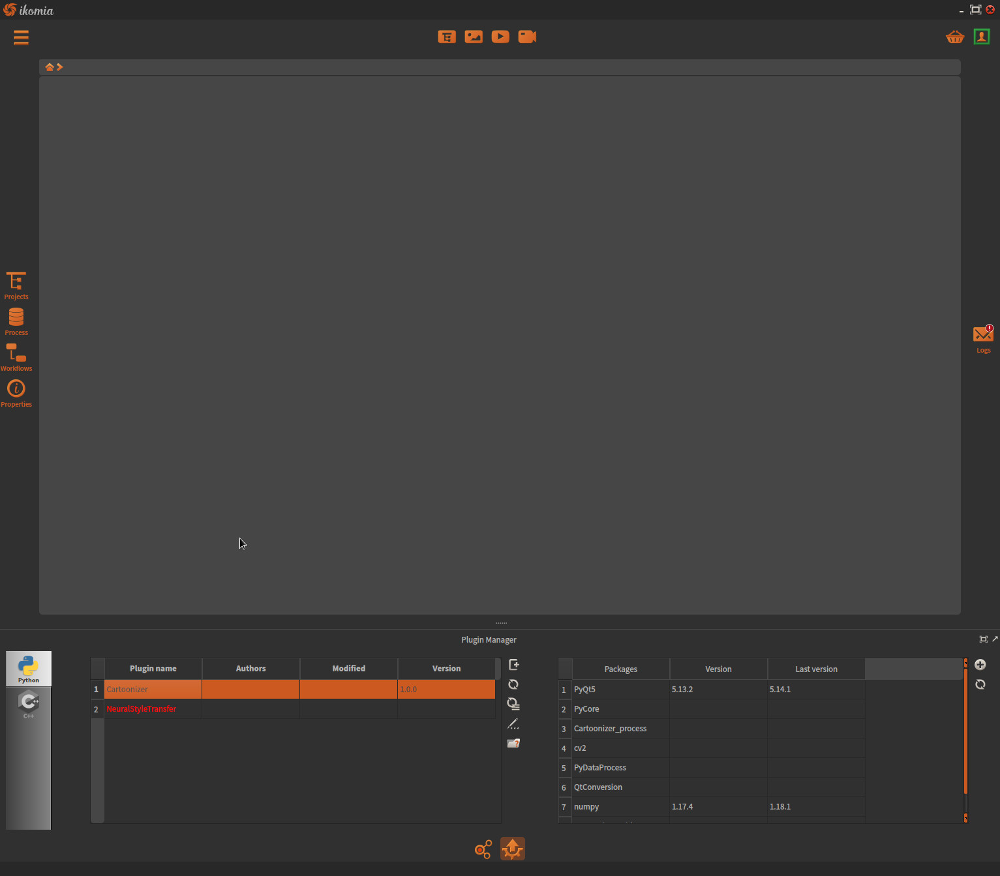

Python environment
==================

Version
-------

Ikomia software comes with its own Python environment, 
completely independant of the one you may install system-wide.
In case of multi-users machine, Ikomia installs one Python environment per user. 
Initially, only required packages are already installed. 
The Python environment configuration may vary among your operating system:

**Windows 10**

- Version: *3.8*
- Path: *c:\\Users\\{username}\Ikomia\Python*
- Installed packages: *pip, numpy=1.19.0, requests, PyQt5=5.15.2, opencv=4.5.0, MLflow=1.14.1*

**Linux**

- Version: *3.7*
- Path: *~/Ikomia/Python*
- Installed packages: *pip, numpy=1.19.0, requests, PyQt5=5.15.2, sip, opencv=4.5.0, MLflow=1.14.1*

**Mac OS X**

- Version: *3.7*
- Path: *~/Ikomia/Python*
- Installed packages: *pip, numpy, requests, PyQt5=5.11.2, sip, opencv=4.2.0*

**Note**: to ensure interoperability with Qt, the PyQt5 package **must not** be updated with pip or other package manager.

Package management
------------------

**pip**

As it is a standalone Python environment, you can manage your packages with pip and all its features.

Windows

.. code-block:: bash

    cd c:\Users\{username}\Ikomia\Python
    python.exe -m pip install {your_package}

Linux and Mac OS X

.. code-block:: bash

    cd ~/Ikomia/Python/bin
    ./python37m -m pip install {your_package}

**Ikomia Plugin Manager**

Ikomia includes a specific module to manage your packages from the GUI:

- The left table shows the list of all your plugins (a plugin in red means a missing dependency).
- The right table shows the list of the selected plugin dependencies (name, version and last version available).

Then you can select a package and make the following actions:

- Install missing package.
- Update package to the latest version.

