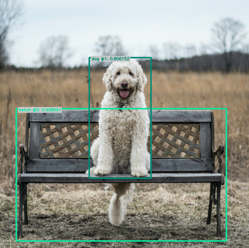
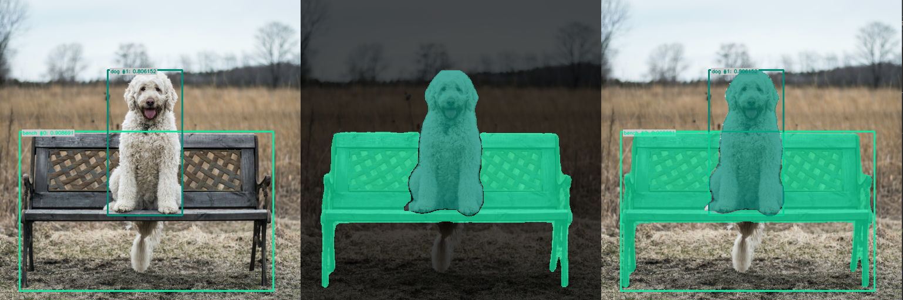
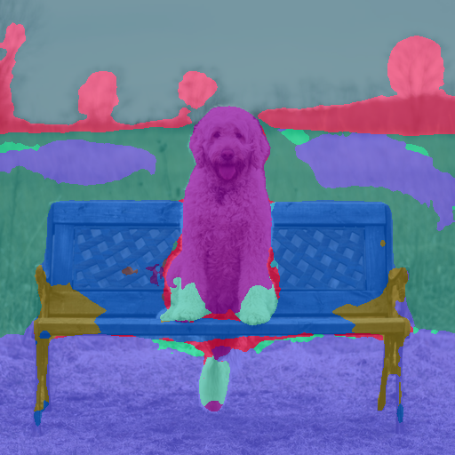
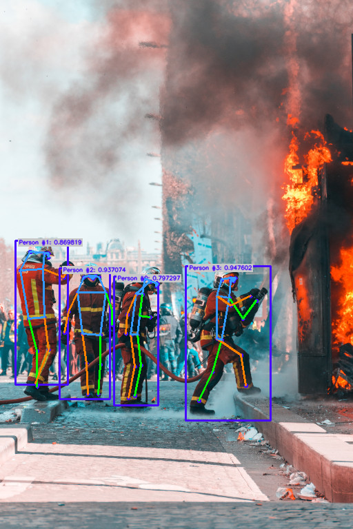

# Input/Output management

Each algorithm in Ikomia specifies a set of inputs and outputs. The type of inputs and outputs may vary depending on the selected algorithm.

This documentation provides a comprehensive list of I/O types to address common needs in Computer Vision.

Let's take the example of YOLO v7 algorithm :
```python
from ikomia.dataprocess.workflow import Workflow
from ikomia.utils import ik

wf = Workflow()

yolov7 = wf.add_task(ik.infer_yolo_v7(), auto_connect=True)
```
```{important}
If you use a notebook (Jupyter, Jupyter Lab or Google Colab), please copy/paste this code snippet for a better display of images.
```
```python
from PIL import ImageShow
ImageShow.register(ImageShow.IPythonViewer(), 0)
```
## `Print()` is your best friend

### Inputs

```python
print(yolov7.get_inputs())
```
This produces the following output :
```shell
[CImageIO(IODataType.IMAGE, CImageIO, /home/yom/Images/dog.jpg), CGraphicsInput(CGraphicsInput)]
```
To access inputs, you just have to do the following:
```python
input_obj = yolov7.get_input(input_index)
```
If input_index = 0, `input_obj` is a {py:mod}`~ikomia.dataprocess.pydataprocess.CImageIO`.

If input_index = 1, `input_obj` is a {py:mod}`~ikomia.dataprocess.pydataprocess.CGraphicsInput`.

### Outputs

```python
print(yolov7.get_outputs())
```
This produces the following output :
```shell
[CImageIO(IODataType.IMAGE, CImageIO, /home/yom/Images/dog.jpg), CObjectDetectionIO()]
```
To access outputs, you just have to do the following:
```python
output_obj = yolov7.get_output(output_index)
```
If output_index = 0, `input_obj` is a {py:mod}`~ikomia.dataprocess.pydataprocess.CImageIO`.

If output_index = 1, `input_obj` is a {py:mod}`~ikomia.dataprocess.pydataprocess.CObjectDetectionIO`.

You can now handle each input/output according to its type.

## Common I/O

### Image

In Ikomia, an image is an object of type {py:mod}`~ikomia.dataprocess.pydataprocess.CImageIO` and the most common function is {py:func}`~ikomia.dataprocess.pydataprocess.CImageIO.get_image`
```python
from ikomia.dataprocess.workflow import Workflow
from ikomia.utils import ik

wf = Workflow()

yolov7 = wf.add_task(ik.infer_yolo_v7(), auto_connect=True)

# wf.run_on(path="path/to/your/image.png")
wf.run_on(url="https://raw.githubusercontent.com/Ikomia-dev/notebooks/main/examples/img/img_dog.png")

input_obj = yolov7.get_input(0) # first input
output_obj = yolov7.get_output(0) # first output

img_in = input_obj.get_image()
img_out = output_obj.get_image()
```
The {py:meth}`~ikomia.dataprocess.pydataprocess.CImageIO.get_image` function returns an image as a numpy array with dimensions [HWC]. When the number of channels is 3, the color format should be RGB.

## Object Detection I/O

To better deal with Object Detection algorithms such as YOLO or EfficientDet, we provide a convenient I/O ({py:mod}`~ikomia.dataprocess.pydataprocess.CObjectDetectionIO`) which stores all objects ({py:mod}`~ikomia.dataprocess.pydataprocess.CObjectDetection`) with the following information:

* Class label
* Confidence
* Bounding box

When you have a {py:mod}`~ikomia.dataprocess.pydataprocess.CImageIO` and a {py:mod}`~ikomia.dataprocess.pydataprocess.CObjectDetectionIO` as outputs, you can easily burn bounding boxes on your image with {py:func}`~ikomia.dataprocess.pydataprocess.CImageIO.get_image_with_graphics`

```python
from ikomia.dataprocess.workflow import Workflow
from ikomia.utils import ik
from ikomia.utils.displayIO import display

wf = Workflow()

yolov7 = wf.add_task(ik.infer_yolo_v7(), auto_connect=True)

# wf.run_on(path="path/to/your/image.png")
wf.run_on(url="https://raw.githubusercontent.com/Ikomia-dev/notebooks/main/examples/img/img_dog.png")

img = yolov7.get_image_with_graphics()

display(img)
```


If you just want the results, use :

```python
# Get results as object
results = yolov7.get_results()

# Get results as JSON
results_json = results.to_json()
```
`results` is a {py:mod}`~ikomia.dataprocess.pydataprocess.CObjectDetectionIO`.

If you want to iterate over the results :
```python
# Get all detected objects
objects = results.get_objects()
# Iterate over all objects
for obj in objects:
    # Do stuff here on your objects
    print("==================================")
    print(f"id: {obj.id}")
    print(f"label: {obj.label}")
    print(f"confidence: {obj.confidence}")
    print(f"box: {obj.box}")
    print(f"color: {obj.color}")
```
It will output:
```shell
==================================
id: 0
label: bench
confidence: 0.93017578125
box: [34.0, 224.0, 433.0, 270.0]
color: [12, 230, 160]
==================================
id: 1
label: dog
confidence: 0.65234375
box: [175.0, 117.0, 136.0, 250.0]
color: [2, 139, 119]
```
## Object Segmentation I/O

### Instance Segmentation I/O

To better deal with Instance Segmentation algorithms such as MaskRCNN or SparseInst, we provide a convenient I/O ({py:mod}`~ikomia.dataprocess.pydataprocess.CInstanceSegmentationIO`) which stores all objects ({py:mod}`~ikomia.dataprocess.pydataprocess.CInstanceSegmentation`) with the following information:

* Class label
* Confidence
* Bounding box = [x, y, width, height]
* Binary mask = numpy array

When you have a {py:mod}`~ikomia.dataprocess.pydataprocess.CImageIO` and a {py:mod}`~ikomia.dataprocess.pydataprocess.CInstanceSegmentationIO` as outputs, you can display different results :

```python
from ikomia.dataprocess.workflow import Workflow
from ikomia.utils import ik
from ikomia.utils.displayIO import display

wf = Workflow()

yolov7 = wf.add_task(ik.infer_yolo_v7_instance_segmentation(), auto_connect=True)

# wf.run_on(path="path/to/your/image.png")
wf.run_on(url="https://raw.githubusercontent.com/Ikomia-dev/notebooks/main/examples/img/img_dog.png")

display(yolov7.get_image_with_graphics())
display(yolov7.get_image_with_mask())
display(yolov7.get_image_with_mask_and_graphics())
```


If you just want the results, use :

```python
# Get results as object
results = yolov7.get_results()

# Get results as JSON
results_json = results.to_json()
```
`results` is a {py:mod}`~ikomia.dataprocess.pydataprocess.CInstanceSegmentationIO`.

If you want to iterate over the results :
```python
# Get all detected objects
objects = results.get_instances()
# Iterate over all objects
for obj in objects:
    # Do stuff here on your objects
    print("==================================")
    print(f"id: {obj.id}")
    print(f"type: {obj.type}")
    print(f"class_index: {obj.class_index}")
    print(f"confidence: {obj.confidence}")
    print(f"box: {obj.box}")
    print(f"color: {obj.color}")
    display(obj.mask*255)
```

### Semantic Segmentation I/O

To better deal with Semantic Segmentation algorithms such as DeepLabV3+ or UNet, we provide a convenient I/O ({py:mod}`~ikomia.dataprocess.pydataprocess.CSemanticSegmentationIO`) which stores the following information:

* Grayscale mask = labelled image where each pixel has a specific value corresponding to its class
* Class names = list associated with the semantic mask

When you have a {py:mod}`~ikomia.dataprocess.pydataprocess.CImageIO` and a {py:mod}`~ikomia.dataprocess.pydataprocess.CSemanticSegmentationIO` as outputs, you can overlay the mask on the image :

```python
from ikomia.dataprocess.workflow import Workflow
from ikomia.utils import ik
from ikomia.utils.displayIO import display

wf = Workflow()

yolov7 = wf.add_task(ik.infer_hf_semantic_segmentation(), auto_connect=True)

# wf.run_on(path="path/to/your/image.png")
wf.run_on(url="https://raw.githubusercontent.com/Ikomia-dev/notebooks/main/examples/img/img_dog.png")

display(yolov7.get_image_with_mask())
```


```python
# Get results as object
results = yolov7.get_results()

# Get results as JSON
results_json = results.to_json()
```
`results` is a {py:mod}`~ikomia.dataprocess.pydataprocess.CSemanticSegmentationIO`.

If you want to exploit the results :
```python
# Get the mask and associated class names
mask = results.get_mask()
classes = results.get_class_names()
print(classes)

# Display class number 2 = sky 
mask_from_class = (mask == 2)
display(mask_from_class)
```
## Pose Estimation I/O

To better deal with pose estimation algorithms, we provide a convenient I/O ({py:mod}`~ikomia.dataprocess.pydataprocess.CKeypointsIO`) which stores all objects ({py:mod}`~ikomia.dataprocess.pydataprocess.CObjectKeypoints` and {py:mod}`~ikomia.dataprocess.pydataprocess.CKeypointLink`) with the following information:

Keypoints:
* Label
* Confidence
* Bounding box = [x, y, width, height]
* Points = list of points (x,y)

Link:
* Starting point index
* Ending point index
* Label

When you have a {py:mod}`~ikomia.dataprocess.pydataprocess.CImageIO` and a {py:mod}`~ikomia.dataprocess.pydataprocess.CKeypointsIO` as outputs, you can burn graphics on your image :

```python
from ikomia.dataprocess.workflow import Workflow
from ikomia.utils import ik
from ikomia.utils.displayIO import display

wf = Workflow()

pose = wf.add_task(ik.infer_mmlab_pose_estimation(), auto_connect=True)

wf.run_on(url="https://raw.githubusercontent.com/Ikomia-dev/notebooks/main/examples/img/img_fireman.jpg")

display(pose.get_image_with_graphics())
```
