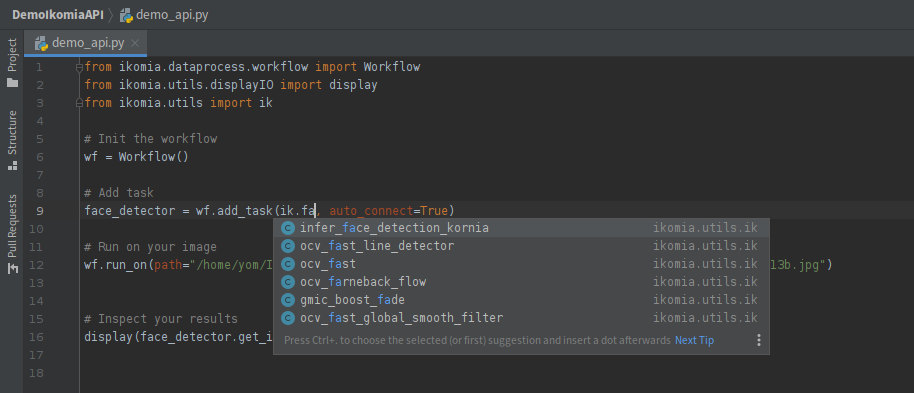
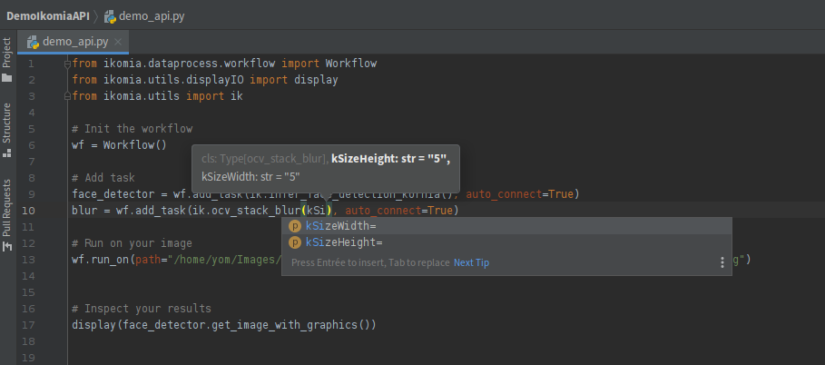

# The `ik` auto-completion system

The`ik` namespace is an auto-completion system designed to facilitate algorithm search and settings.

An algorithm is a set of instructions that a computer program follows to perform a specific task or solve a particular problem. 
For example, an algorithm can be used to sort a list of numbers or detect faces in an image. When you're developing a program, you may want to use an algorithm that someone else has already created to save time and effort.

**Algorithm search** is the process of finding and selecting an algorithm that meets your needs. 
In the context of the `ik` namespace described in the documentation you provided, algorithm search refers to the process of finding and selecting algorithms that are available through the Ikomia system, either locally on your machine or through the Ikomia HUB.

**Algorithm settings** refer to the parameters or options that can be adjusted to customize the behavior of an algorithm. 
For example, if you're using an algorithm to detect faces in an image, you may be able to adjust settings such as the minimum size of a detected face or the level of confidence required for a detection. 
Adjusting these settings can help you achieve better results depending on your specific needs. 
In the context of the `ik` namespace, algorithm settings can be adjusted using a function-like syntax that allows you to set the parameters of an algorithm in your code.

## The `ik` structure

When you use Ikomia API for the first time, it creates 3 files listing all available algorithms in the Ikomia environment.

* `auto_complete.local` : this file contains all algorithms already installed on your machine
* `auto_complete.online` : this file contains all algorithms from Ikomia HUB
* `ik.py` : this file contains all algorithms (local and online)

In `ik.py`, each algorithm is described with the same pattern :
* Parameters as class attribute
* `__new__` overload for function-like settings
* a static method to retrieve the name of the algorithm

```python
class ocv_stack_blur:
    kSizeHeight = "kSizeHeight"
    kSizeWidth = "kSizeWidth"

    def __new__(cls, kSizeHeight: str="5", kSizeWidth: str="5"):
        algo = ik_registry.create_algorithm("ocv_stack_blur", None)
        algo.set_parameters({
            "kSizeHeight": kSizeHeight,
            "kSizeWidth": kSizeWidth,
        })
        return algo

    @staticmethod
    def name():
        return "ocv_stack_blur"
```

## Algorithm search

You can find all the algorithms offered by Ikomia by visiting the [Ikomia HUB](https://github.com/Ikomia-hub) repository on GitHub.

However, as a developer, you need to easily access all algorithms in an intuitive and ergonomic manner as you are coding. That's why we created the ik namespace, which is a suitable tool for IDEs (such as PyCharm, VSCode) or notebooks.



```{warning}
If you're scripting in a text editor or by command line, the `ik` auto-completion won't work.
```

## Algorithm settings

As with algorithm search, every coder may want to easily set parameters to test functions. That's why we adopted a function-like method to set algorithm parameters.



Here is a code example of algorithm settings :
```python
from ikomia.dataprocess.workflow import Workflow
from ikomia.utils import ik
from ikomia.utils.displayIO import display

wf = Workflow()

face_detector = wf.add_task(ik.infer_face_detection_kornia(), auto_connect=True)
# face_detector = wf.add_task(ik.infer_face_detection_kornia(conf_thres="0.2"), auto_connect=True)
# face_detector = wf.add_task(ik.infer_face_detection_kornia(conf_thres="0.9"), auto_connect=True)

blur = wf.add_task(ik.ocv_stack_blur(), auto_connect=True)
# blur = wf.add_task(ik.ocv_stack_blur(kSizeHeight="15", kSizeWidth="15"), auto_connect=True)
# blur = wf.add_task(ik.ocv_stack_blur(kSizeHeight="61", kSizeWidth="61"), auto_connect=True)

wf.run_on(url="https://raw.githubusercontent.com/Ikomia-dev/notebooks/main/examples/img/img_people.jpg")

display(blur.get_output(0).get_image())
```