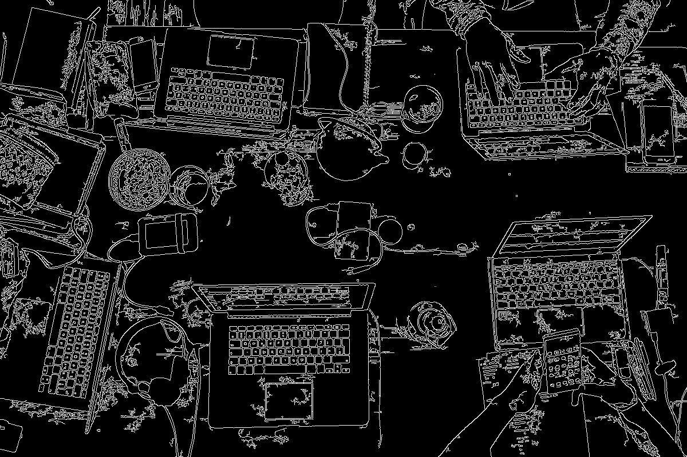
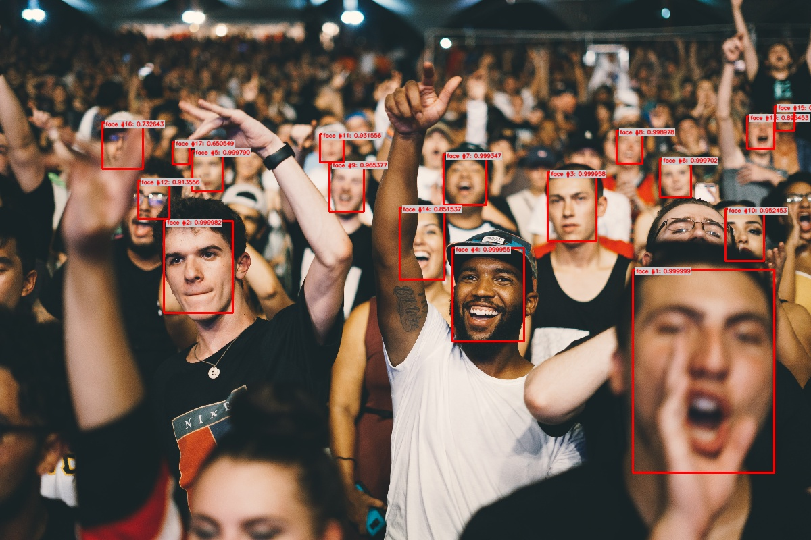

# Getting Started

## Installation

We strongly recommend using a virtual environment. 
If you're not sure where to start, we offer a tutorial [here](bonus/virtual_env).

### Installing Ikomia API

Install Ikomia API
```sh
pip install ikomia
```

```{warning}
We only support Python 3.7, 3.8, 3.9 and 3.10 on Windows 10 and Linux.
```

## Pre-requisites

Open your favorite IDE (PyCharm, VS Code...) and create a new project in your virtual environment.<br>
Then, you can just copy/paste the different examples below.<br>

```{important}
If you use a notebook (Jupyter, Jupyter Lab or Google Colab), please copy/paste this code snippet for a better display of images.
```
```python
from PIL import ImageShow
ImageShow.register(ImageShow.IPythonViewer(), 0)
```
___
## Basic usage : workflow with 1 algorithm

In this example, we simply use the **Canny Edge Detector** from OpenCV.<br>

### Workflow Structure

```{mermaid}
%%{
  init: {
    'theme': 'base',
    'themeVariables': {
      'primaryBorderColor': '#CC5A20',
      'lineColor': '#CC5A20'
    }
  }
}%%
    graph LR
    A[(Input images)] -.-> B(ocv_canny)
    B -.-> C[(Output images)]
```

### Code

Create and run your 1st workflow.
```python
from ikomia.dataprocess.workflow import Workflow
from ikomia.utils.displayIO import display

# Init your workflow
wf = Workflow()

# Add the Canny Edge Detector
canny = wf.add_task(name="ocv_canny", auto_connect=True)

# Run on your image    
# wf.run_on(path="path/to/your/image.png")
wf.run_on(url="https://raw.githubusercontent.com/Ikomia-dev/notebooks/main/examples/img/img_work.jpg")


# Inspect your results
display(canny.get_input(0).get_image())
display(canny.get_output(0).get_image())
```
For a step by step explanation, see [here](advanced_guide/index).

### Results

Source image               |  Canny Edge Detector
:-------------------------:|:-------------------------:
  |  


## Basic usage : workflow with 1 algorithm from Ikomia HUB

In this example, we use an algorithm from Ikomia HUB.<br>
Just run your workflow and at runtime, it will automagically download and install all algorithms (if not already installed) on your machine.

### Workflow Structure

```{mermaid}
%%{
  init: {
    'theme': 'base',
    'themeVariables': {
      'primaryBorderColor': '#CC5A20',
      'lineColor': '#CC5A20'
    }
  }
}%%
    graph LR
    A[(Input images)] -.-> B(infer_yolo_v7)
    B -.-> C[(Output images)]
```

### Code

Create and run your workflow.
```python
from ikomia.dataprocess.workflow import Workflow
from ikomia.utils.displayIO import display

# Init your workflow
wf = Workflow()    

# Add the YOLO v7 Object Detector
yolov7 = wf.add_task(name="infer_yolo_v7", auto_connect=True)

# Run on your image  
# wf.run_on(path="path/to/your/image.png")
wf.run_on(url="https://raw.githubusercontent.com/Ikomia-dev/notebooks/main/examples/img/img_work.jpg")

# Inspect your results
display(yolov7.get_input(0).get_image())
display(yolov7.get_image_with_graphics())
```
For a step by step explanation, see [here](advanced_guide/index).

### Results

Source image               |  YOLO v7 Object Detector
:-------------------------:|:-------------------------:
  |  


## Advanced usage : workflow with 1 algorithm + custom settings

### Workflow Structure

```{mermaid}
%%{
  init: {
    'theme': 'base',
    'themeVariables': {
      'primaryBorderColor': '#CC5A20',
      'lineColor': '#CC5A20'
    }
  }
}%%
    graph LR
    A[(Input images)] -.-> B(ocv_canny)
    B -.-> C[(Output images)]
```

### Code

Adjust the algorithm parameters with our `ik` [auto-completion](advanced_guide/ik_namespace) mechanism ...

```python
from ikomia.dataprocess.workflow import Workflow
from ikomia.utils.displayIO import display
from ikomia.utils import ik

# Init your workflow
wf = Workflow()

# Add the Canny Edge Detector with specific parameters
canny = wf.add_task(ik.ocv_canny(threshold1="100", threshold2="200"), auto_connect=True)

# Run on your image  
# wf.run_on(path="path/to/your/image.png")
wf.run_on(url="https://raw.githubusercontent.com/Ikomia-dev/notebooks/main/examples/img/img_work.jpg")

# Inspect your results
display(canny.get_input(0).get_image())
display(canny.get_output(0).get_image())
```
... or use a classic Dict approach
```python
from ikomia.dataprocess.workflow import Workflow
from ikomia.utils.displayIO import display

# Init your workflow
wf = Workflow()

# Add the Canny Edge Detector
canny = wf.add_task(name="ocv_canny", auto_connect=True)

# Change Canny parameters
canny.set_parameters({ 
    "threshold1": "100",
    "threshold2": "200"
}) 

# Run on your image  
# wf.run_on(path="path/to/your/image.png")
wf.run_on(url="https://raw.githubusercontent.com/Ikomia-dev/notebooks/main/examples/img/img_work.jpg")

# Inspect your results
display(canny.get_input(0).get_image())
display(canny.get_output(0).get_image())
```

For a step by step explanation, see [here](advanced_guide/index).

### Results

Source image                 |  Canny Edge Detector
:---------------------------:|:-------------------------:
  |  


## Advanced usage : workflow with 2 algorithms + custom settings

### Workflow Structure

```{mermaid}
%%{
  init: {
    'theme': 'base',
    'themeVariables': {
      'primaryBorderColor': '#CC5A20',
      'lineColor': '#CC5A20'
    }
  }
}%%
    graph LR
    A[(Input images)] -.-> B(infer_face_detection_kornia)
    B --> C(ocv_blur)
    C -.-> D[(Output images)]
```

### Code

```python
from ikomia.dataprocess.workflow import Workflow
from ikomia.utils.displayIO import display
from ikomia.utils import ik

# Init your workflow
wf = Workflow()

# Add the Kornia Face Detector
face = wf.add_task(ik.infer_face_detection_kornia(), auto_connect=True) 

# Add a blur effect
blur = wf.add_task(ik.ocv_blur(kSizeWidth="61", kSizeHeight="61"), auto_connect=True)

# Run on your image  
# wf.run_on(path="path/to/your/image.png")
wf.run_on(url="https://raw.githubusercontent.com/Ikomia-dev/notebooks/main/examples/img/img_people.jpg")

# Inspect your results
display(face.get_image_with_graphics())
display(blur.get_output(0).get_image())
```

### Results

Kornia Face Detector       |  Blurred faces
:-------------------------:|:-------------------------:
  |  


## Advanced usage : export results to JSON

### Code

Create and run your workflow.
```python
from ikomia.dataprocess.workflow import Workflow
from ikomia.utils import ik

# Init your workflow
wf = Workflow()    

# Add the YOLO v7 Object Detector
yolov7 = wf.add_task(ik.infer_yolo_v7(), auto_connect=True)

# Run on your image
# wf.run_on(path="path/to/your/image.png")
wf.run_on(url="https://raw.githubusercontent.com/Ikomia-dev/notebooks/main/examples/img/img_work.jpg")

# Get results as JSON
results_json = yolov7.get_results().to_json(["json_format", "indented"])
print(results_json)
```
For a step by step explanation, see [here](advanced_guide/index).

### Results

```zsh
{
    "detections": [
        {
            "box": {
                "height": 235.06271362304688,
                "width": 286.51531982421875,
                "x": 853.1284790039062,
                "y": 374.7386779785156
            },
            "color": {
                "a": 9,
                "b": 50,
                "g": 99,
                "r": 232
            },
            "confidence": 0.9322412014007568,
            "id": 0,
            "label": "laptop"
        }
    ]
}
```
___
## Advanced usage : export workflow to JSON

### Code

Create and export your workflow as JSON.
```python
from ikomia.dataprocess.workflow import Workflow
from ikomia.utils import ik

# Init your workflow
wf = Workflow("My workflow")        

# Add the YOLO v7 Object Detector
yolov7 = wf.add_task(ik.infer_yolo_v7(), auto_connect=True)

# Save your workflow as JSON in the current folder or specify a path
# wf.save("/path/to/my_workflow.json")
wf.save("./my_workflow.json")
```

Then just load and run your workflow.
```python
from ikomia.dataprocess import workflow
from ikomia.utils import ik
from ikomia.utils.displayIO import display

# Load your workflow from the current folder or specify a path
# wf = workflow.load("/path/to/my_workflow.json")
wf = workflow.load("./my_workflow.json")

# Run on your image
# wf.run_on(path="path/to/your/image.png")
wf.run_on(url="https://raw.githubusercontent.com/Ikomia-dev/notebooks/main/examples/img/img_work.jpg")

# Find all tasks with the name 'infer_yolo_v7' in the workflow
# and store them in a list
# yolov7_list = wf.find_task("infer_yolo_v7")
yolov7_list = wf.find_task(ik.infer_yolo_v7.name())
yolov7 = yolov7_list[0]

# Inspect your results
display(yolov7.get_input(0).get_image())
display(yolov7.get_image_with_graphics())

```

For a step by step explanation, see [here](advanced_guide/index).

### Results

Source image               |  YOLO v7 Object Detector
:-------------------------:|:-------------------------:
  |  


## Conclusion

Congratulations! You've reached the end of the quickstart guide.
You should now have a good understanding of how to use Ikomia API to create, customize and run workflows with various algorithms.
Feel free to explore more features and create your own amazing workflows!
