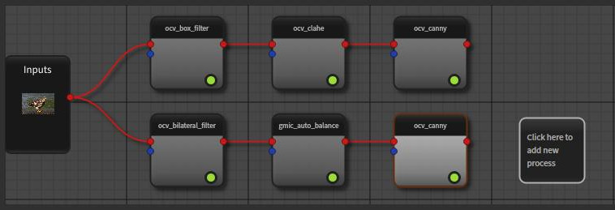

Going deeper with workflows
===========================

Set workflow inputs
-------------------

In the previous section, we use :py:meth:`~ikomia.dataprocess.workflow.Workflow.run_on` to execute a workflow on common inputs. 
But this function can only be used for a workflow with a single input. In fact, a workflow object is also a task 
(:py:mod:`~ikomia.dataprocess.workflow.Workflow` is derived from :py:mod:`~ikomia.core.CWorkflowTask`) and you can add as many inputs as you want. 
Please find below the generic way to set workflow inputs.

.. code-block:: python

    from ikomia.core import IODataType
    from ikomia.dataprocess import workflow, CImageIO

    wf = workflow.create("MyWorkflow")
    # create image inputs
    first_input = CImageIO(IODataType.IMAGE, "1st", "path/to/image1")
    second_input = CImageIO(IODataType.IMAGE, "2nd", "path/to/image2")
    # add 2 inputs
    wf.addInput(first_input)
    wf.addInput(second_input)
    # Or
    wf.setInput(first_input, 0)
    wf.setInput(second_input, 1)

See :py:meth:`~ikomia.dataprocess.workflow.Workflow.addInput` and :py:meth:`~ikomia.dataprocess.workflow.Workflow.setInput` for details.

The :py:mod:`~ikomia.dataprocess.workflow.Workflow` class also provides helper functions to ease the management of image inputs. You can use 
:py:meth:`~ikomia.dataprocess.workflow.Workflow.set_image_input` and :py:meth:`~ikomia.dataprocess.workflow.Workflow.set_directory_input` 
for this specific data type.

Get a specific workflow task
----------------------------

In some cases, it may be necessary to access the task object instance directly. The :py:mod:`~ikomia.dataprocess.workflow.Workflow` class provides 
a single method to get a task from its name: :py:meth:`~ikomia.dataprocess.workflow.Workflow.find_task`. When a workflow has several tasks with the 
same name, the function returns the list of candidates. Please note that the candidates are sorted according to their order of insertion in the workflow, 
from the oldest to the most recent. You can also specify a zero-based index (insertion order) to get the wanted task only.

Considering the following workflow:

Here is how you will retrieve a specific task:

.. code-block:: python

    from ikomia.dataprocess import workflow

    wf = workflow.load("path/to/workflow")
    # Get the bilateral filter task
    bilateral_id, bilateral_obj = wf.find_task("ocv_bilateral_filter")
    # Get the candidates for Canny filter
    # canny_candidates is a list of pairs (id, obj) here
    canny_candidates = wf.find_task("ocv_canny")
    # Get the first inserted Canny filter task
    first_canny_id, first_canny_obj = wf.find_task("ocv_canny", 0)
    # Get the second inserted Canny filter task
    second_canny_id, second_canny_obj = wf.find_task("ocv_canny", 1)

.. note::
    When you create a workflow from scratch, the function :py:meth:`~ikomia.dataprocess.workflow.Workflow.add_task` returns a pair (id, obj) that could be used 
    to get the task later. In this case, you should call :py:meth:`~ikomia.dataprocess.workflow.Workflow.getTask` with the corresponding id instead of 
    :py:meth:`~ikomia.dataprocess.workflow.Workflow.find_task` (faster).

Get workflow outputs
--------------------

The generic way to get workflow outputs is to firstly get the task object and then get its outputs.

.. code-block:: python

    from ikomia.dataprocess import workflow

    wf = workflow.create("ObjectDetection")
    # Store id and object instance while adding task to the workflow
    yolov4_id, yolov4_obj = wf.add_task("infer_yolo_v4")
    wf.connect_tasks(wf.getRootID(), yolov4_id)

    wf.run_on(path="path/to/image.png")

    # Optional use find_task
    yolov4_id, yolov4_obj = wf.find_task("infer_yolo_v4")

    # Get outputs
    # 1 - Forwarded source image: CImageIO object
    img_output = yolov4_obj.getOutput(0)
    # 2 - Graphics objects (box): CGraphicsOutput object
    graphics_output = yolov4_obj.getOutput(1)
    # 3- Box information: CBlobMeasureIO object
    box_output = yolov4_obj.getOutput(2)

The :py:mod:`~ikomia.dataprocess.workflow.Workflow` class provides convenient methods to get outputs by type. For all these methods, 
you could get outputs from the task name or the task id (faster). When using task name, the methods will return a list of outputs for all matching 
tasks. When a task has several outputs of the same type, you can specify the output index (zero-based index among all outputs).

- :py:meth:`~ikomia.dataprocess.workflow.Workflow.get_image_output`
- :py:meth:`~ikomia.dataprocess.workflow.Workflow.get_graphics_output`
- :py:meth:`~ikomia.dataprocess.workflow.Workflow.get_numeric_output`
- :py:meth:`~ikomia.dataprocess.workflow.Workflow.get_data_string_output`
- :py:meth:`~ikomia.dataprocess.workflow.Workflow.get_blob_measure_output`
- :py:meth:`~ikomia.dataprocess.workflow.Workflow.get_dataset_output`
- :py:meth:`~ikomia.dataprocess.workflow.Workflow.get_array_output`
- :py:meth:`~ikomia.dataprocess.workflow.Workflow.get_path_output`

.. code-block:: python

    from ikomia.dataprocess import workflow

    wf = workflow.create("ObjectDetection")
    # Store id and object instance while adding task to the workflow
    yolov4_id, yolov4_obj = wf.add_task("infer_yolo_v4")
    wf.connect_tasks(wf.getRootID(), yolov4_id)

    wf.run_on(path="path/to/image.png")

    img_output = wf.get_image_output(yolov4_id)
    graphics_output = wf.get_graphics_output(yolov4_id)
    box_output = wf.get_blob_measure_output(yolov4_id)

.. note::
    We provide high-level methods to handle image outputs. Thus from a workflow object, you can access image array directly  
    (:py:meth:`~ikomia.dataprocess.workflow.Workflow.get_image`) or compute the merge image (for visualization) between graphics and image 
    outputs (:py:meth:`~ikomia.dataprocess.workflow.Workflow.get_image_with_graphics`).

Handle the workflow graph structure
-----------------------------------

A workflow is a graph where the nodes are the runnable tasks (algorithms) and the links between nodes are connections from task outputs to task inputs.
Basically, you need two methods to build your own workflow:

- :py:meth:`~ikomia.dataprocess.workflow.Workflow.add_task`: instanciate an algorithm object and add it to the workflow. All algorithms are identified by their unique names and the function uses this name to create instance (factory design pattern). Instanciation process firstly searches for installed algorithms in the registry. If not found, it searches in Ikomia HUB and do all installation steps automatically. Note that this installation can take a while (download package and install dependencies) but it will be executed once.
- :py:meth:`~ikomia.dataprocess.workflow.Workflow.connect_tasks`: connect 2 tasks of the workflow so that output data from the source task will be forwarded to target task input when running the workflow.

The first way to connect tasks is to let the system create connections automatically based on input and output data types. This will work well in simple scenarios. 
In the following example, we will create a simple workflow composed by a Box Filter (noise reduction) and CLAHE algorithm (histogram equalization). Both tasks have 
2 inputs (IMAGE + GRAPHICS) and 1 output (IMAGE). In this simple case, auto-connection will work well and make the code easy.

.. code-block:: python

    from ikomia.utils import ik
    from ikomia.dataprocess import workflow

    wf = workflow.create("MyWorkflow")

    # Add Box Filter
    box_filter_id, box_filter = wf.add_task(ik.ocv_box_filter)

    # Connect to root (auto-connection)
    wf.connect_tasks(wf.getRootID(), box_filter_id)

    # Add CLAHE
    clahe_id, clahe = wf.add_task(ik.ocv_clahe)

    # Connect to Box Filter (auto-connection)
    wf.connect_tasks(box_filter_id, clahe_id)

If you want to have a full control in the connection mechanism, you could set manually the list of connections between 2 tasks. A connection is defined as a pair of index, 
the first one being the output index of the source task, the second being the input index of the target task. You must pass a list of pairs because 2 tasks can be connected 
by multiple output-input links. Adding a DT Filter with manual connections to the previous workflow will look like this:

.. code-block:: python

    # Add DT Filter algorithm to the workflow
    dtfilter_id, dtfilter = wf.add_task(ik.ocv_dt_filter)

    # Connect to CLAHE with manual connections
    wf.connect_tasks(clahe_id, dtfilter_id, [(0, 0), (0, 1)])

The :py:mod:`~ikomia.dataprocess.workflow.Workflow` class provides also functions to browse the graph structure of an existing workflow. Consult 
:py:meth:`~ikomia.dataprocess.workflow.Workflow.getTaskIDs`, :py:meth:`~ikomia.dataprocess.workflow.Workflow.getTask`, 
:py:meth:`~ikomia.dataprocess.workflow.Workflow.getParents`, :py:meth:`~ikomia.dataprocess.workflow.Workflow.getFinalTasks`, 
:py:meth:`~ikomia.dataprocess.workflow.Workflow.getInEdges`, :py:meth:`~ikomia.dataprocess.workflow.Workflow.getOutEdges`, 
:py:meth:`~ikomia.dataprocess.workflow.Workflow.getEdgeSource`, :py:meth:`~ikomia.dataprocess.workflow.Workflow.getEdgeTarget`, 
:py:meth:`~ikomia.dataprocess.workflow.Workflow.getEdgeInfo` for details.

Create a Deep Learning training workflow
----------------------------------------

Training deep learning models is an important use case of Ikomia API. The workflow approach is also well suited for this case and you can handle it 
with few lines of code. Basically, it will consist in 2 main tasks:

- a dataset loader that will convert your custom dataset structure into the Ikomia Dataset structure. This conversion is mandatory to leverage all training algorithms you can find in Ikomia HUB. We provide dataset loader of common formats like COCO, PascalVOC, YOLO...
- a training algorithm. You will find various algorithms in Ikomia HUB for classification, object detection, segmentation...

Here is an example of a training workflow for a YOLOv4 model and a custom dataset in YOLO format (grapes detection):

.. code-block:: python

    from ikomia.utils import ik
    from ikomia.dataprocess import workflow

    wf = workflow.create("MyTrainingWorkflow")

    # Add dataset loader for grapes dataset
    # No need to connect dataset loader task to root node as it does not need workflow input
    wgisd_id, wgisd = wf.add_task("dataset_wgisd")
    dataset_params = {
        ik.dataset_wgisd_param.data_folder_path: "path/to/data/folder",
        ik.dataset_wgisd_param.class_file_path: "path/to/class/file.txt" 
    }
    wf.set_parameters(dataset_params, task_id=wgisd_id)

    # Add YOLO training algorithm
    yolo_id, yolo = wf.add_task(ik.train_yolo)
    yolo_params = { ik.train_yolo_param.model: "yolov4" }
    wf.set_parameters(yolo_params, task_id=yolo_id)
    wf.connect_tasks(wgisd_id, yolo_id)

    # Start training
    wf.run()

.. note::
    Ikomia API integrates MLflow and Tensorboard for training monitoring. Depending on the algorithm implementation, 
    you will have access to metrics, parameters, artifacts in MLflow or Tensorboard or both. 
    
.. important::
    If you need a model not present in Ikomia HUB, it is quiet easy to port your preferred model in Ikomia ecosystem.
    Documentation can be found :doc:`here <index_plugin>` and :doc:`here <plugin_task>`.

Working with video files
------------------------

Processing video files is available out of the box. Ikomia API leverages OpenCV video reader capabilities to apply
any workflows on whole video. Basically, it will execute the workflow on every frames and return when all frames are
processed. You should enable the auto-save mode (:py:meth:`~ikomia.core.pycore.CWorkflowTask.setAutoSave`) at
workflow or task level to save outputs to disk. Output folder can be set at either workflow or task level also
(:py:meth:`~ikomia.core.pycore.CWorkflowTask.setOutputFolder`), default is the user home folder.

.. code-block::

    from ikomia.dataprocess import workflow

    wf = workflow.load("path_to_your_workflow")
    # Enable auto-save mode to let Ikomia API save outputs to disk for all tasks
    wf.setAutoSave(True)
    # Video from local filesystem
    wf.run_on(path="path_to_your_video.avi")
    # Video from public url
    wf.run_on(url="url_of_your_video")
    # Batch processing from a folder
    wf.run_on(folder="local_folder_containing_your_videos")

Working with video streams
--------------------------

At this time, we do not offer high level API to handle streams. On the other hand, it is very simple to
run a workflow on each frame acquired by a third-party video library. Here is an example with OpenCV:

.. code-block::

    from ikomia.utils import ik
    from ikomia.dataprocess import workflow
    import cv2

    # Initializing stream capture
    cap = cv2.VideoCapture(0)

    # Build workflow
    wf = workflow.create("MyVideoWorkflow")
    clahe_id, clahe = wf.add_task(ik.ocv_clahe)
    wf.connect_tasks(wf.getRootID(), clahe_id)
    canny_id, canny = wf.add_task(ik.ocv_canny)
    wf.connect_tasks(clahe_id, canny_id)

    while True:
        ret, img = cap.read()
        # Execute on current frame
        wf.run_on(array=img)
        res_img = wf.get_image(canny_id, 0)
        cv2.imshow("Result", res_img)

        if cv2.waitKey(1) == 27:
            break

    cv2.destroyAllWindows()

Get workflow time metrics
-------------------------

Ikomia API provides functions to get executing time of a workflow, globally and at task level.

Get the total time (:py:meth:`~ikomia.dataprocess.workflow.Workflow.getTotalElapsedTime`):

.. code-block::

    from ikomia.dataprocess import workflow

    wf = workflow.load("path/to/workflow.json")
    wf.set_image_input(path="path/to/image.png")
    wf.run()

    # Executing time in ms
    time_ms = wf.getTotalElapsedTime()

Get executing time for each task 
(:py:meth:`~ikomia.core.pycore.CWorkflowTask.getElapsedTime` and 
:py:meth:`~ikomia.dataprocess.workflow.Workflow.getElapsedTimeTo`):

.. code-block::

    from ikomia.dataprocess import workflow

    wf = workflow.load("path/to/workflow.json")
    wf.set_image_input(path="path/to/image.png")
    wf.run()

    ids = wf.getTaskIDs()
    for task_id in ids:
        task = wf.getTask(task_id)
        time_ms = task.getElapsedTime()
        time_to_ms = wf.getElapsedTimeTo(task_id)

You can also get all metrics in a dict structure (:py:meth:`~ikomia.dataprocess.workflow.Workflow.get_time_metrics`):

.. code-block::

    from ikomia.dataprocess import workflow

    wf = workflow.load("path/to/workflow.json")
    wf.set_image_input(path="path/to/image.png")
    wf.run()
    metrics = wf.get_time_metrics()
