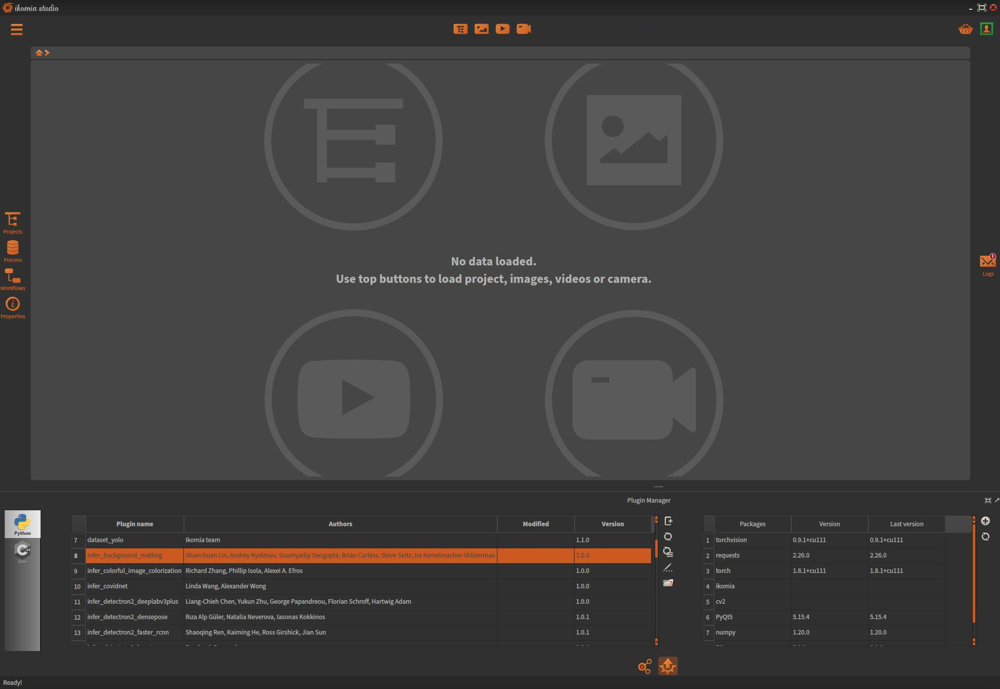
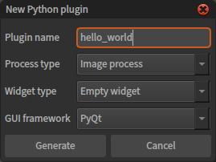

Hello world plugin
==================

In this first tutorial, we will create an empty plugin and introduce the core mechanisms.
Basically, first steps of plugin creation can be done either manually or with our dedicated module.

With Ikomia Plugin Manager (recommended)
----------------------------------------

The simplest way to create plugins is to use the integrated Plugin Manager:

The left table shows the list of all your plugins, you will find a list of action buttons to its right.
Click on the first button to start creating a plugin:

Set parameters:

- *Plugin name*: must be **unique** as it is the identifier of the plugin. The given name will appear in the Ikomia process library.
- *Process type*: rely on the source data type. This choice determines the base class on which the process class will be derived from:

    - *Generic process*: no input/output and no data structure pre-defined. See :py:class:`~ikomia.core.pycore.CWorkflowTask`.
    - *Image process*: image processing plugin.
    
        - inputs: image + graphics layer
        - ouputs: image

        See :py:class:`~ikomia.dataprocess.pydataprocess.C2dImageTask`.

    - *Interactive image process*: image processing plugin with user interation capability. Same inputs/outputs as image process option. See :py:class:`~ikomia.dataprocess.pydataprocess.C2dImageInteractiveTask`.
    - *Video process*: video processing plugin.

        - inputs: video + graphics layer
        - ouputs: video 

        See :py:class:`~ikomia.dataprocess.pydataprocess.CVideoTask`.

    - *Optical flow process*: video processing plugin dedicated to Optical Flow. Same inputs/outputs as video process option. See :py:class:`~ikomia.dataprocess.pydataprocess.CVideoOFTask`.
- *Widget type*: empty widget only (for instance). User must create his own widget according to algorithm parameters. Basic knowledge of Qt framework is recommended. See :py:class:`~ikomia.core.pycore.CWorkflowTaskWidget`.
- *GUI framework*: Qt based Python framework. PyQt5 recommended.

Click on **Generate** button.

Your plugin is now **created** and **ready to use**. It is automatically loaded and you can access it from the process library of Ikomia.
At this point, the plugin can be added to any workflow but does nothing.

The minimal structure of a plugin is composed by these files:

- *__init__.py*: Python regular package
- :doc:`hello_world.py <hello_world_plugin_interface>`: implementation of plugin interface. See :py:class:`~ikomia.dataprocess.pydataprocess.CPluginProcessInterface`.
- :doc:`hello_world_process.py <hello_world_plugin_process>`: implementation of the algorithm, its parameters, its metadata and the factory to create process instance.
- :doc:`hello_world_widget.py <hello_world_plugin_widget>`: implementation of the widget and the factory to create an instance.

.. note:: the code generated by the Plugin Manager is self documented and will guide you through all the required step.

With you prefered Python IDE
----------------------------

Because an Ikomia plugin is a regular Python package, you can create it from scratch with the IDE of your choice.

Here are the steps you should follow:

1. Create a new folder into our dedicated folder with the name of your plugin
    Windows

    .. code-block:: bash

        mkdir c:\Users\{username}\Ikomia\Plugins\Python\hello_world

    Linux and Mac OS X

    .. code-block:: bash

        mkdir ~/Ikomia/Plugins/Python/hello_world

2. Create your project (optional)

3. Choose the Ikomia Python interpreter (optional). Ikomia Python interpreter is located in:

    Windows

    .. code-block:: bash

        c:\Users\{username}\Ikomia\Python\

    Linux and Mac OS X

    .. code-block:: bash

        ~/Ikomia/Python/

4. Create the 4 required Python files from your IDE
    - *__init__.py*
    - *hello_world.py*
    - *hello_world_process.py*
    - *hello_world_widget.py*

    .. note:: The naming scheme of these files is very important: see the section :doc:`naming convention <naming>` for details.

4. Implement the plugin interface that will allow your plugin to be loaded in Ikomia. See example :doc:`hello_world.py <hello_world_plugin_interface>`.

5. Implement your process. See example :doc:`hello_world_process.py <hello_world_plugin_process>`.

6. Implement your widget. See example :doc:`hello_world_widget.py <hello_world_plugin_widget>`.

That's it. Launch Ikomia, your plugin will be loaded automatically.
