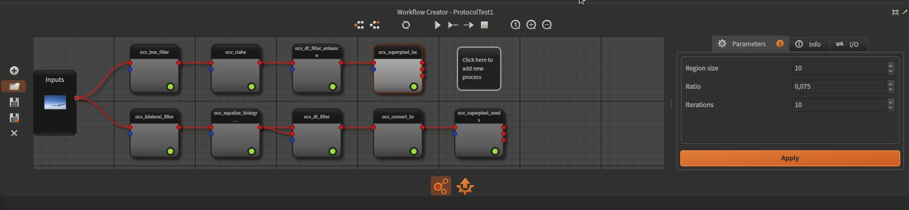

Implement Computer Vision workflows for your application
========================================================

This part of the Ikomia API aims to leverage algorithms coming from Ikomia HUB into standalone application. It provides a simple and fast way to
integrate state of the art methods to your image analysis pipeline. Ikomia API is framework-agnostic, algorithms can be implemented in your favorite
Python library (PyTorch, TensorFlow, Scikit-image ...).

.. note::
    If you are interested in integrating your own algorithm in Ikomia, please consult :doc:`this documentation <index_plugin>`.

Registration (free)
-------------------

Leverage state of the art algorithms from Ikomia HUB is one of the big advantage of using Ikomia API. Then you will need a free Ikomia account so that
you will be able to authenticate while using Ikomia API. If we don't have the chance yet to count you among our users, we invite you to
`register here <https://members.ikomia.com/accounts/signup/>`_.

Installation
------------

You simply install Ikomia API via pip for Linux and Windows:

.. code-block:: zsh

    pip install ikomia

Another version is also available which provides a GPU-enabled version of OpenCV (CUDA 11, CuDNN 8). This version gives
you access to OpenCV algorithms with GPU acceleration, especially the Deep Learning inference framework.

.. code-block:: zsh

    pip install ikomia==0.8.0+cu11 -f https://packages.ikomia.com/ikomia/index.html

.. note::
    For this version, we provide Python wheels for Python 3.7, 3.8 and 3.9. It includes OpenCV package (v4.5.2). For GPU
    acceleration with your favorite framework (PyTorch, TensorFlow...), you must have installed CUDA 11 drivers for your
    graphic card and the GPU-enabled version of this framework.

    For Linux users, the wheel targets the platform manylinux2014 so that it should be compatible with most of recent
    distributions.

    For Windows, the wheel is only compatible with Windows 10.

.. Important::
    **OpenCV**
    
    A version of OpenCV with specific options is bundled within the Ikomia package. It includes all the core
    and contribution librairies. There is only one important constraint to respect, **you must import Ikomia
    module before importing cv2 module**. As a result, the package *opencv-python* or *opencv-python-headless* from Pypi repository should not be installed in
    the same Python environment. This may lead to incompatibility issues.

Concepts
--------

Workflow
^^^^^^^^

This is the core concept to leverage algorithms in your application. It consists in a graph-based structure that allows to build complex 
scenario by connecting tasks (ie algorithms) through inputs and outputs. Workflow can either be created from scratch or loading from file 
exported by the workflow editor of Ikomia Studio. In the second case, no code is needed, you just have to build your workflow graphically, 
evaluate it on your data and export it when you are done.

The Python class :py:mod:`~ikomia.dataprocess.workflow.Workflow` is based on a C++ implementation to ensure performance.

    Ikomia Studio workflow editor

Registry
^^^^^^^^

The registry module ensures the algorithm management in the Ikomia platform. The module manages operations like download, installation, update 
and instanciation. All algorithms are uniquely identified by their name. So you will handle tasks primarly by their names while implementing 
your workflow. When importing the Python ikomia module, you will have acces to the global Ikomia registry 
(:py:mod:`~ikomia.dataprocess.registry.IkomiaRegistry`).

Task
^^^^

A task represents the implementation of a specific algorithm. The common usage of the task object is to insert it in a workflow as a node and connect 
it to others tasks. But a task is also a standalone object that can be executed independently. In Ikomia platform, a task implementation has to
follow a specific architecture (plugin mechanism) as described in :doc:`this section <index_plugin>`. This API provides high level functions to 
facilitate the use of Ikomia tasks (:py:mod:`~ikomia.core.task`).

Inputs and outputs
^^^^^^^^^^^^^^^^^^

Every task comes with a list of inputs and outputs. Tasks are connected within a workflow thanks to their inputs/outputs. Ikomia workflow 
is designed to deal with almost any algorithm based on image. So depending of the algorithm, you will have to deal with several types of 
inputs/outputs. This API provides a comprehensive list of I/O types to address common needs in Computer Vision. You will find more 
information :doc:`here <plugin_io>`.

Authentication
--------------

Access to Ikomia HUB is reserved for registered users. So if you need algorithms from HUB in your workflow, you have
to set your Ikomia credentials in environment variables: **IKOMIA_USER** and **IKOMIA_PWD**.

In practice
-----------

Let's dive now into the API with practical examples:

.. toctree::
    :maxdepth: 1

    first_steps_workflow
    going_deeper_workflow
    working_with_task
    display_tools
