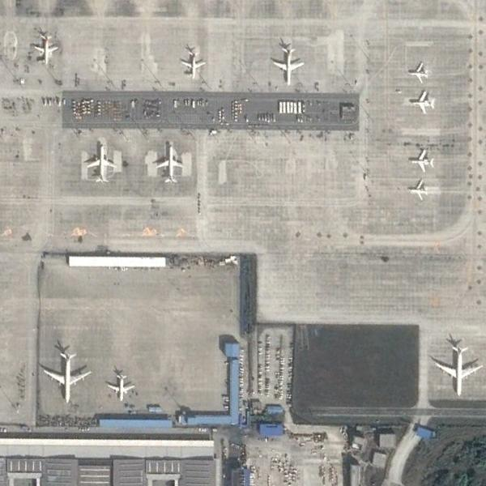
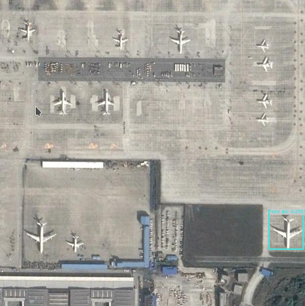
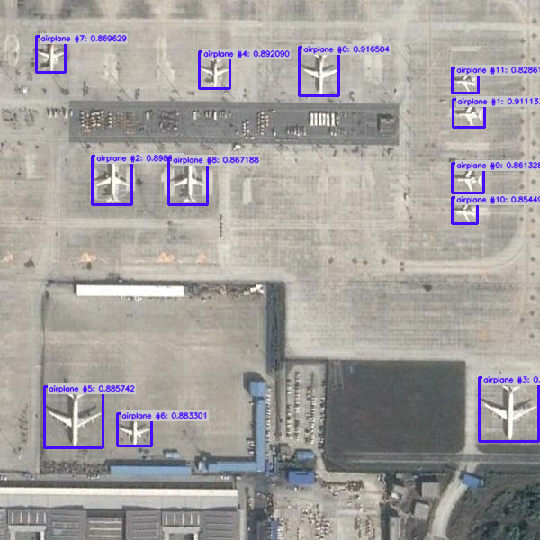

# First Steps in Object Detection with Ikomia API

Ikomia API is a powerful tool for creating and managing computer vision workflows. 

In this tutorial, we will guide you through the process of creating an Object Detection solution using the Ikomia API. 
Object Detection is a computer vision technique to identify and locate objects within an image or a video stream. 
It combines image classification and localization tasks to recognize and locate multiple objects of interest in a single image.

## The Problem

In this tutorial, our goal is to detect and count airplanes from aerial images such as the one shown below:



```{important}
1. Please download this annotated dataset from roboflow : [https://universe.roboflow.com/ds/W8grf6DmCF?key=QkQVA4pg66](https://universe.roboflow.com/ds/W8grf6DmCF?key=QkQVA4pg66).
2. Create a specific folder **aerial** and extract the download zip files in it.
3. In **aerial**, you should see 3 folders (test, train, val) and text files.
```
```python
# Set path to your annotated dataset
dataset_path = "/path/to/aerial"
```
```{important}
If you use a notebook (Jupyter, Jupyter Lab or Google Colab), please copy/paste this code snippet for a better display of images.
```
```python
from PIL import ImageShow
ImageShow.register(ImageShow.IPythonViewer(), 0)
```
## Test Object Detection Algorithms

There are many detection algorithms, you can find some of the best ones in the Ikomia HUB.

In this section, we create and run your first Object Detection workflow. 

```python
from ikomia.dataprocess.workflow import Workflow
from ikomia.utils.displayIO import display
from ikomia.utils import ik

# Initialize the workflow
wf = Workflow()

# Add an Object Detection algorithm  
yolo = wf.add_task(ik.infer_yolo_v7(), auto_connect=True)

# Run on your image
wf.run_on(path=dataset_path+"/test/airport_246_jpg.rf.3d892810357f48026932d5412fa81574.jpg")

# Inspect your results
display(yolo.get_image_with_graphics())
```


The workflow consists of loading an image, applying an Object Detection algorithm, and visualizing the results. If you are not familiar with the Ikomia API, please refer to the [Getting Started](../getting_started) page.

At this stage, we can observe that the results are not satisfactory. The main reason is that `infer_yolo_v7` uses a default model trained on the COCO dataset. 
This dataset contains thousands of images, but no aerial images of airports, so the model doesn't know what an airplane looks like from above.

That's why you downloaded the previous dataset. You now have hundreds of images annotated by humans (bounding box around airplanes in aerial images), and we are going to exploit them.

## Train Your Custom Model

With the dataset of aerial images that you downloaded, you can train a custom YOLO v7 model using Ikomia API. 
The downloaded dataset is in YOLO format, which means that for each image in each folder (test, val, train), there is a corresponding .txt file containing all bounding box and class information associated with airplanes. 
Additionally, there is a `_darknet.labels` file containing all class names.

To load the custom data and annotations, we will use the dataset_yolo module provided by Ikomia API. Here's how you can train your custom model:

```python
from ikomia.dataprocess.workflow import Workflow
from ikomia.utils import ik

# Initialize the workflow
wf = Workflow()

# Add a dataset loader to load your custom data and annotations
dataset = wf.add_task(ik.dataset_yolo(
    dataset_folder=dataset_path+"/train", 
    class_file=dataset_path+"/train/_darknet.labels"
    )
)

# Add a training algorithm
yolo = wf.add_task(ik.train_yolo_v7(
    batch_size="4", 
    epochs="10", 
    output_folder="output_folder"
    ), 
    auto_connect=True
)

# Launch your training on your data
wf.run()
```
In the above code, we first create a new Workflow object and add a `dataset_yolo` task to load our custom data and annotations. 
We pass the path to the folder containing the training data (folder_path) and the path to the `_darknet.labels` file containing the class names (class_file_path) as arguments to the task.

Next, we add a `train_yolo_v7` task to train our custom YOLO v7 model. We specify the batch size (`batch_size`) and the number of epochs (`epochs`) to train for. 
We also specify the output folder path (`output_folder`) where the trained model will be saved. The `auto_connect=True` argument ensures that the output of the `dataset_yolo` task is automatically connected to the input of the `train_yolo_v7` task.

Finally, we run the workflow to start the training process. You can monitor the progress of your training using tools like Tensorboard or MLFlow.

Once the training is complete, the `train_yolo_v7` task will save the best model in a timestamped folder inside the `output_folder`. You can find your `best.pt` model in the weights subfolder.

To test and evaluate your own model on your images, you can use the following code:
```python
from ikomia.dataprocess.workflow import Workflow
from ikomia.utils.displayIO import display
from ikomia.utils import ik

# Initialize the workflow
wf = Workflow()

# Add an Object Detection algorithm  
yolo = wf.add_task(ik.infer_yolo_v7(
        model_path="output_folder/[timestamp]/weights/best.pt", 
        conf_thres="0.4"
    ), 
    auto_connect=True)

# Run on your image
wf.run_on(path=dataset_path+"/test/airport_246_jpg.rf.3d892810357f48026932d5412fa81574.jpg")

# Inspect your results
display(yolo.get_image_with_graphics())
```


Here, we add an `infer_yolo_v7` task to apply our trained model for object detection on the image. We specify the path to our trained model using the `custom_model` argument.
We then run the workflow on the same image that we used previously.

Once you have performed the object detection, you may need to use the results in your application. Here is an example of how you can extract the results using YOLO:

```python
# Get results
results = yolo.get_results()
# Get results as list of objects
objects = results.get_objects()
# Convert results to JSON
results_json = results.to_json()
```
The `get_results()` method returns a `CObjectDetectionIO` object containing the detected objects and their respective bounding boxes. 
You can then use the `to_json()` method to convert the `CObjectDetectionIO` object to a JSON string, which can be further processed by your application.

Finally, you can get the total number of airplanes for each image:
```python
print(f"Total number of airplanes : {len(objects)}")
```

## Conclusion

In this tutorial, we have shown how to use YOLOv7 to perform object detection on images and videos. 
We have covered the steps required to train a custom YOLOv7 model, as well as how to use a pre-trained model to detect objects in real-time. 
We have also explored how to fine-tune the model to improve its accuracy on specific object classes.

YOLOv7 is a powerful object detection algorithm that can be used in a wide range of applications, from surveillance systems to self-driving cars. 
By following the steps outlined in this tutorial, you should have a good understanding of how YOLOv7 works and how to use it to detect objects in your own images and videos. 
With some practice and experimentation, you can fine-tune the algorithm to suit your specific needs and achieve even better results.