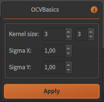

Simple OpenCV plugin
====================

This section will show how to create a fully functional plugin applying basics OpenCV methods to images. It takes image as input and delivers processed image as output.

We skip here all steps to create a new empty plugin. Please refer to :doc:`Hello World tutorial <hello_world_plugin>` if you are not familiar with it.

At this point, a plugin called *OCVBasics* is created with the following structure:
    .../*BasicsOpenCV/*
        - *__init__.py*
        - *OCVBasics.py*
        - *OCVBasics_process.py*
        - *OCVBasics_widget.py*

Interface implementation
------------------------

No features added from the default implementation.
See :doc:`OCVBasics.py <opencv_plugin_interface>`.

Process implementation
----------------------

The aim of our plugin is to process images, so our task is derived from :py:class:`~~ikomia.dataprocess.pydataprocess.CImageProcess2d`. 
This base class comes with default inputs (image + graphics) and outputs (image) that fit our needs.

Our process pipeline will be: *Convert to grayscale* -> *Gaussian blur* -> *Canny filter*.

The first thing to do in our *OCVBasics_process.py* is importing OpenCV package (already installed):

.. code-block:: python
    
    from ikomia import core, dataprocess
    import copy
    # Your imports below
    import cv2

In the *run* method, we now have to retrieve source image from input, add OpenCV calls and set the output:

.. code-block:: python

    class OCVBasicsProcess(dataprocess.CImageProcess2d):

        #...

        def run(self):
            # Core function of your process
            # Call beginTaskRun for initialization
            self.beginTaskRun()

            # Get input :
            input_img = self.getInput(0)

            # Get image from input (numpy array):
            src_image = input_img.getImage()

            # Call to the process main routine
            # Grayscale conversion
            proc_img = cv2.cvtColor(src_image, cv2.COLOR_RGB2GRAY)
            # Gaussian blur
            proc_img = cv2.GaussianBlur(proc_img, (5,5), 1)
            # Canny filter
            proc_img = cv2.Canny(proc_img, 0, 255)

            # Get output :
            output = self.getOutput(0)

            # Set image of output (numpy array):
            output.setImage(proc_img)

            # Step progress bar:
            self.emitStepProgress()

            # Call endTaskRun to finalize process
            self.endTaskRun()

Reload plugin in Ikomia software (with Plugin Manager or in the main menu), add it to a new workflow to test the results. You should have this:

Process parameters
------------------

We will focus now on adding some parameters to our process ((in *OCVBasics_process.py*). 
Let's say we want to control blur strengh of the Gaussian filter, we have to manage at least 3 parameters:

- Kernel size
- Sigma X
- Sigma Y

First, we add member variables in the parameters class, they will be accessible from the process. 
Note the presence of functions :py:meth:`~~ikomia.core.pycore.CProtocolTaskParam.setParamMap` and :py:meth:`~~ikomia.core.pycore.CProtocolTaskParam.getParamMap`
which are required to save/load values when user wants to save his workflow.

.. code-block:: python

    class OCVBasicsProcessParam(core.CProtocolTaskParam):

        def __init__(self):
            core.CProtocolTaskParam.__init__(self)
            # Place default value initialization here
            self.kernel_size = (3, 3)
            self.sigma_x = 1.0
            self.sigma_y = 1.0

        def setParam(self, paramMap):
            # Set parameters values from Ikomia application (user inputs)
            # Parameters values are stored as string and accessible like a python dict
            self.kernel_size = (int(paramMap["kernel_size_x"]), int(paramMap["kernel_size_y"]))
            self.sigma_x = int(paramMap["sigma_x"])
            self.sigma_y = int(paramMap["sigma_y"])
            pass

        def getParam(self):
            # Send parameters values to Ikomia application (workflow)
            # Create the specific dict structure (string container)
            paramMap = core.ParamMap()
            paramMap["kernel_size_x"] = str(self.kernel_size[0])
            paramMap["kernel_size_y"] = str(self.kernel_size[1])
            paramMap["sigma_x"] = str(self.sigma_x)
            paramMap["sigma_y"] = str(self.sigma_y)
            return paramMap

We are now able to manage parameters from the process. The constructor receives an instance of the parameters structure that we should copy. This instance has values set from the Ikomia application (default or user-defined).

.. code-block:: python

    class OCVBasicsProcess(dataprocess.CImageProcess2d):
    
        def __init__(self, name, param):
            dataprocess.CImageProcess2d.__init__(self, name)

            #Create parameters class
            if param is None:
                self.setParam(OCVBasicsProcessParam())
            else:       
                self.setParam(copy.deepcopy(param))

Finally, we modify the *run* method to pass parameters to GaussianBlur function:

.. code-block:: python

    class OCVBasicsProcess(dataprocess.CImageProcess2d):

        def run(self):
            # Core function of your process
            # Call beginTaskRun for initialization
            self.beginTaskRun()

            # Get parameters :
            param = self.getParam()

            #...

            # Gaussian blur
            proc_img = cv2.GaussianBlur(proc_img, param.kernel_size, param.sigma_x, param.sigma_y)

            #...

Process widget
--------------

At this point, parameters are only available from source code. 
The role of the plugin widget is to open parameters configuration to the user.
We will use PyQt framework for this example.

We implement the widget part in the file *OCVBasics_widget.py*. 
The widget layout is created in the constructor. 
Like the process class, the constructor receives an instance of the parameters structure to initialize the widget components.

.. code-block:: python

    class OCVBasicsWidget(core.CProtocolTaskWidget):

        def __init__(self, param, parent):
            core.CProtocolTaskWidget.__init__(self, parent)

            if param is None:
                self.parameters = processMod.OCVBasicsProcessParam()
            else:
                self.parameters = param

            # Create layout : QGridLayout by default
            self.gridLayout = QGridLayout()
            
            # Kernel size
            label_kernel_size = QLabel('Kernel size:')
            
            self.spin_kernel_x = QSpinBox()
            self.spin_kernel_x.setRange(1, 99)
            self.spin_kernel_x.setSingleStep(2)
            self.spin_kernel_x.setValue(self.parameters.kernel_size[0])

            self.spin_kernel_y = QSpinBox()
            self.spin_kernel_y.setRange(1, 99)
            self.spin_kernel_y.setSingleStep(2)
            self.spin_kernel_y.setValue(self.parameters.kernel_size[1])

            self.gridLayout.addWidget(label_kernel_size, 0, 0)
            self.gridLayout.addWidget(self.spin_kernel_x, 0, 1)
            self.gridLayout.addWidget(self.spin_kernel_y, 0, 2)

            # Sigma X
            label_sigma_x = QLabel('Sigma X:')
            self.spin_sigma_x = QDoubleSpinBox()
            self.spin_sigma_x.setRange(0.0, 255.0)
            self.spin_sigma_x.setSingleStep(0.1)
            self.spin_sigma_x.setValue(self.parameters.sigma_x)

            self.gridLayout.addWidget(label_sigma_x, 1, 0)
            self.gridLayout.addWidget(self.spin_sigma_x, 1, 1)

            # Sigma Y
            label_sigma_y = QLabel('Sigma Y:')
            self.spin_sigma_y = QDoubleSpinBox()
            self.spin_sigma_y.setRange(0.0, 255.0)
            self.spin_sigma_y.setSingleStep(0.1)
            self.spin_sigma_y.setValue(self.parameters.sigma_y)

            self.gridLayout.addWidget(label_sigma_y, 2, 0)
            self.gridLayout.addWidget(self.spin_sigma_y, 2, 1)

            # PyQt -> Qt wrapping (C++ handle)
            layoutPtr = utils.PyQtToQt(self.gridLayout)

            # Set widget layout
            self.setLayout(layoutPtr)

In Ikomia, plugin widgets are shown in 2 different places:

- in a popup windows when you add a plugin to the workflow (from the process library pane)
- in the Workflow Creator window where you can see parameters of the current task

Let's see how our widget looks:

Last thing, we have to update process parameters when a user change values through the widget. 
We do that by overriding :py:meth:`~~ikomia.core.pycore.CProtocolTaskWidget.onApply` method. 
It is called when user clicks the *Apply* button.

.. code-block:: python

    class OCVBasicsWidget(core.CProtocolTaskWidget):
        # ...

        def onApply(self):
            # Apply button has been pressed
            # Get parameters value from widget components
            self.parameters.kernel_size = (self.spin_kernel_x.value(), self.spin_kernel_y.value())
            self.parameters.sigma_x = self.spin_sigma_x.value()
            self.parameters.sigma_y = self.spin_sigma_y.value()

            # Send signal to launch the process
            self.emitApply(self.parameters)

Our plugin is now fully functional!

Process metadata
----------------

Finally, we will add some useful information about our plugin. 
Ikomia software manages such information and display it to the user (parameters widget, Ikomia Store).
Metadata can be added in the constructor of the process factory class in *OCVBasics_process.py*. 
We have to fill the member object *info*, see :py:class:`~~ikomia.dataprocess.pydataprocess.CProcessInfo` for details.

.. code-block:: python

    class OCVBasicsProcessFactory(dataprocess.CProcessFactory):

        def __init__(self):
            dataprocess.CProcessFactory.__init__(self)
            # Set process information as string here
            self.info.name = "OCVBasics"
            self.info.shortDescription = "OpenCV Canny"
            self.info.description = "Simple OpenCV pipeline that computes Canny filter"
            self.info.authors = "Ikomia team"
            self.info.article = ""
            self.info.journal = ""
            self.info.year = 2020
            self.info.license = "MIT License"
            self.info.version = "1.0.0"
            self.info.repo = "https://github.com/Ikomia-dev"
            self.info.documentationLink = "https://ikomia.com"
            # relative path -> as displayed in Ikomia application process tree
            self.info.path = "Plugins/Python/Ikomia/Examples"
            # If you want to customize plugin icon
            self.info.iconPath = ""
            # Associated keywords, for search
            self.info.keywords = "OpenCV,blur,grayscale,canny,edge,gaussian"

Source code
-----------

:doc:`OCVBasics.py <opencv_plugin_interface>`

:doc:`OCVBasics_process.py <opencv_plugin_process>`

:doc:`OCVBasics_widget.py <opencv_plugin_widget>`